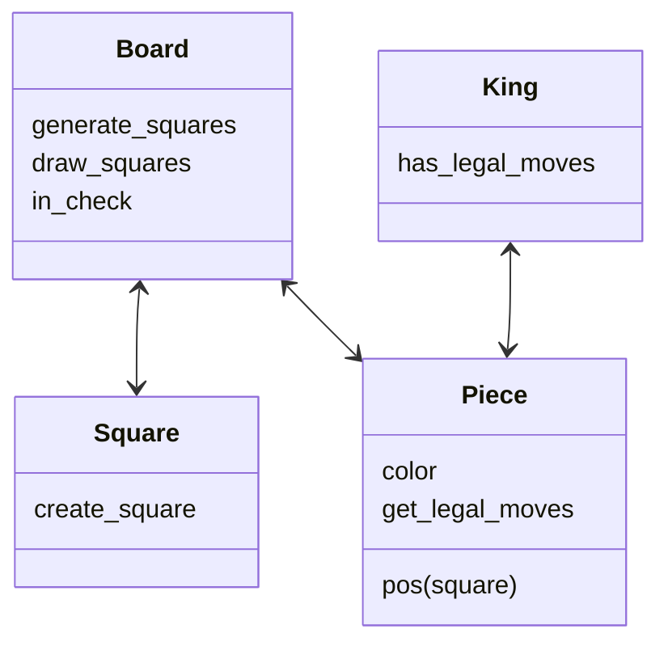

sequenceDiagram
    participant User
    participant Board
    participant Square
    participant Piece
    User->>Board: create_board(width, height)
    Board->>Board: __init__(width, height)
    Board->>Board: create_squares()
    Board->>Square: __init__(file, rank, width, height)
    Board->>Board: get_square(pos)
    Board->>Piece: __init__(color, pos, board, piece_type)
    Board->>Square: set_occupying_piece(piece)
    User->>Board: mouse_click(mouse_x, mouse_y)
    Board->>Board: get_clicked_square(mouse_x, mouse_y)
    Board->>Piece: is_valid_move(new_pos)
    Piece->>Square: get_pos()
    Square->>Board: get_square(pos)
    Board->>Square: get_occupying_piece()
    Piece->>Piece: move_piece(new_pos)
    Board->>Square: set_occupying_piece(piece)
    Board->>Board: change_turn()
 
