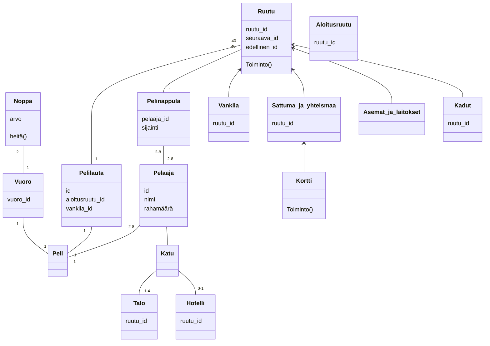

```mermaid
 classDiagram
      Pelaaja "2-8" -- "1" Peli
      Vuoro "1" -- "1" Peli
      Pelilauta "1" -- "1" Peli
      Noppa "2" -- "1" Vuoro
      Pelinappula "2-8" -- "2-8" Pelaaja
      Ruutu "40" -- "1" Pelilauta
      Ruutu "40" -- "1" Pelinappula
      Katu -- "1-4" Talo
      Katu -- "0-1" Hotelli
      Pelaaja -- Katu
      
      Ruutu <-- Vankila
      Ruutu <-- Sattuma_ja_yhteismaa
      Ruutu <-- Asemat_ja_laitokset
      Ruutu <-- Kadut
      Sattuma_ja_yhteismaa <-- Kortti


    

      class Peli{
      }
      class Vuoro{
          vuoro_id
      }
      class Noppa{
          arvo
          heitä()
      }
      class Pelaaja{
          id
          nimi
          rahamäärä
      }
      class Pelinappula{
          pelaaja_id
          sijainti
      }
      class Pelilauta{
          id
          aloitusruutu_id
          vankila_id
          
      }
      class Ruutu{
          ruutu_id
          seuraava_id
          edellinen_id
          Toiminto()

      }
      class Aloitusruutu{
          ruutu_id
      }

      class Vankila{
          ruutu_id


      }
      class Sattuma_ja_yhteismaa{
          ruutu_id
            
      }
      class Kortti{
          Toiminto()

      }
      
      class Kadut{
          ruutu_id
      }
      class Talo{
          ruutu_id
        
      }
      class Hotelli{
          ruutu_id
      }
```