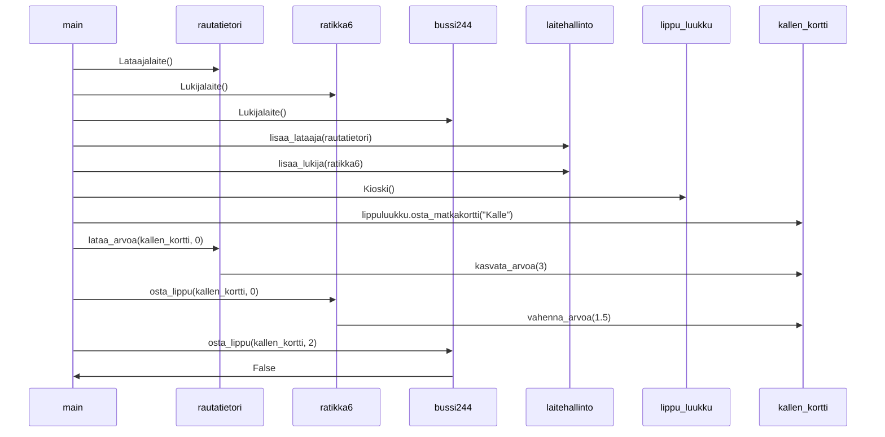

```mermaid
    sequenceDiagram
    main ->> rautatietori: Lataajalaite()
    main ->> ratikka6: Lukijalaite()
    main ->> bussi244: Lukijalaite()
    main ->> laitehallinto: lisaa_lataaja(rautatietori)
    main ->> laitehallinto: lisaa_lukija(ratikka6)
    main ->> lippu_luukku: Kioski()
    main ->> kallen_kortti: lippuluukku.osta_matkakortti("Kalle")
    main ->> rautatietori: lataa_arvoa(kallen_kortti, 0)
    rautatietori ->> kallen_kortti: kasvata_arvoa(3)
    main ->> ratikka6: osta_lippu(kallen_kortti, 0)
    ratikka6 ->> kallen_kortti: vahenna_arvoa(1.5)
    main ->> bussi244: osta_lippu(kallen_kortti, 2)
    bussi244 ->> main: False 
    
```