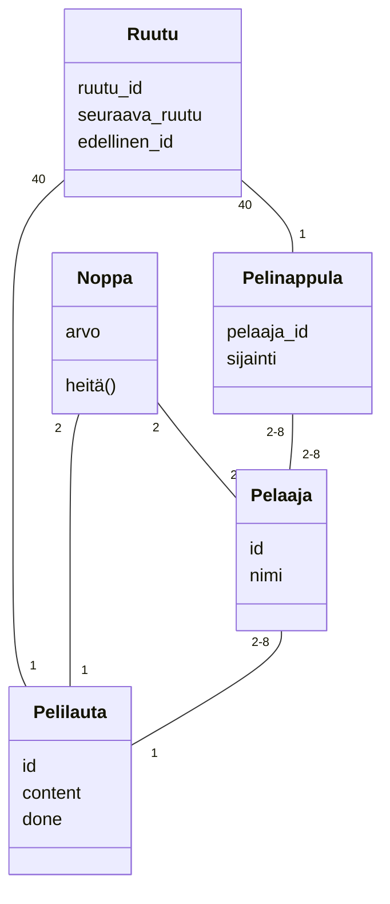

```mermaid
 classDiagram
      Pelaaja "2-8" -- "1" Pelilauta
      Pelinappula "2-8" -- "2-8" Pelaaja
      Ruutu "40" -- "1" Pelilauta
      Ruutu "40" -- "1" Pelinappula
      Noppa "2" -- "1" Pelilauta
      Noppa "2" -- "2-8" Pelaaja
      
      
      class Noppa{
          arvo
          heitä()
      }
      class Pelaaja{
          id
          nimi

      }
      class Pelinappula{
          pelaaja_id
          sijainti
      }
      class Pelilauta{
          id
          content
          done
      }
      class Ruutu{
          ruutu_id
          seuraava_ruutu
          edellinen_id
          
      }
```
